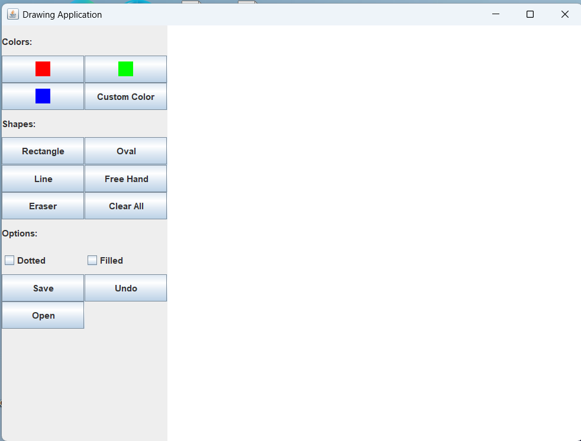

# Java Paint Brush Application

A simple drawing application built with Java Swing. It lets you create basic geometric shapes, freehand sketches, and do some simple image editing. Perfect for small design tasks.





## Features

- **Drawing Tools**
  - Precise shapes: lines, rectangles, and ovals
  - Freehand sketching with smooth strokes
  - Eraser with 10px white strokes (optimized for white backgrounds)

- **Image Integration**
  - Open and auto-scale JPG/PNG/BMP files
  - Overlay images as editable layers

- **Customization**
  - Line styles: dotted strokes with 5px gaps and filled shapes (note: filled shapes cannot be combined with dotted lines)
  - Color selection: preset colors (Red, Green, Blue) and a custom RGB slider picker

- **Workflow Enhancements**
  - Undo last action (stack-based history)
  - Auto-save feature with sequential file naming (e.g., `drawing_1.png`, `drawing_2.png`)
  - One-click canvas clearing

- **User Interface**
  - Dynamic cursors (crosshair for shapes, pencil for freehand, block for eraser)
  - Visual feedback with highlighted tool and color selections

## Installation

### Prerequisites
- Java JDK 8 or later

### Setup
1. Clone the repository:
   ```bash
   git clone https://github.com/mhdash6/Paint-Brush-Java-
   cd Paint-Brush-Java-
